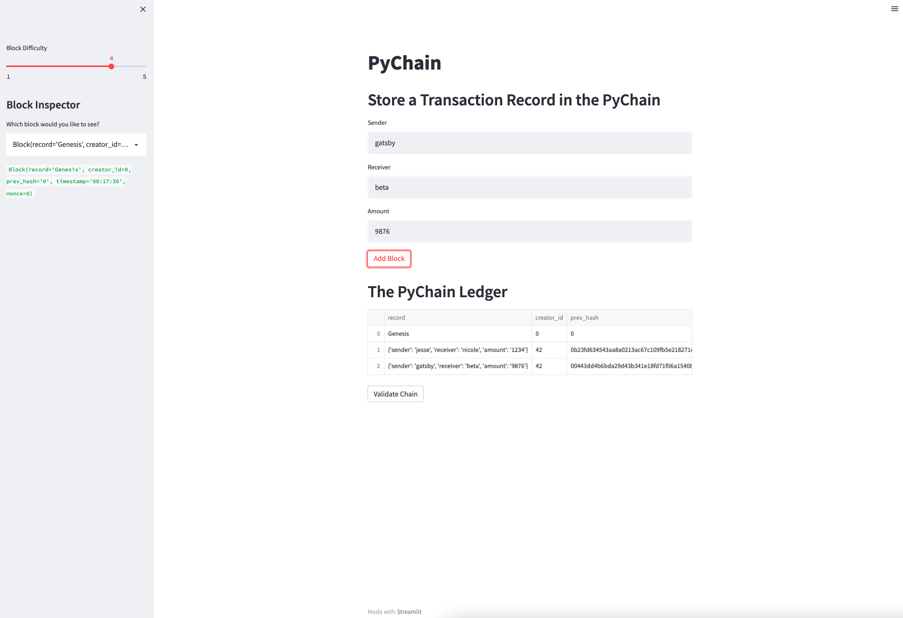
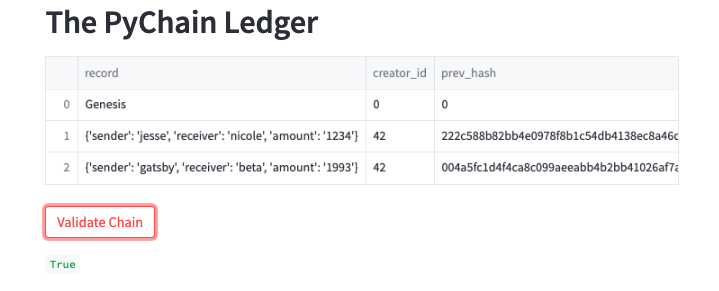

# PyChain-Ledger

## Goal
* act as the lead developer on their decentralized finance team.
* build a blockchain-based ledger system, complete with a user-friendly web interface.
* this ledger should allow partner banks to conduct financial transactions (that is, to transfer money between senders and receivers) and to verify the integrity of the data in the ledger.

